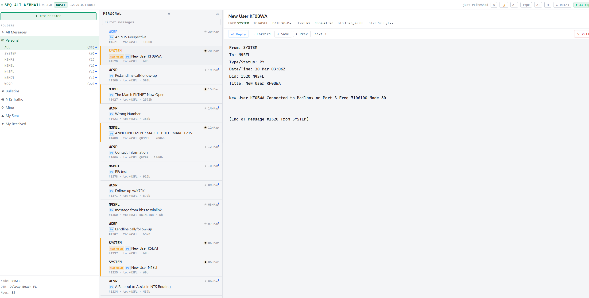

# BPQ-Alt-WebMail

A modern, single-file webmail interface for [BPQ32](https://www.cantab.net/users/john.wiseman/Documents/BPQMailChat.html) packet radio BBS nodes. Drop one HTML file into your BPQ HTML directory and open it in your browser.



## Features

### Interface
- **Three-pane layout** — folder sidebar, message list, message reader
- **Light and dark themes** — toggle with ☀/🌙 button, preference saved
- **Adjustable font size** — A- / A+ buttons scale all text simultaneously
- **Draggable column widths** — drag the dividers between panes
- **Auto-refresh** — polls BPQ every 5 minutes, shows new messages silently
- **Session key auto-detection** — no manual token entry needed; detects and recovers from key rotation automatically

### Folders
- All Messages, Personal (inbox), Bulletins, NTS Traffic, Mine, My Sent, My Received
- **Personal subfilters** — filter by sender callsign; SYSTEM pinned at top
- **Bulletin subfilters** — filter by TO category (SITREP, TECHNI, ARISS, etc.)
- Message counts and unread indicators on every filter

### Message List
- Unread dot indicators
- **★ Star filter** — click ★ in list header to show only starred messages
- **Multi-select** — hover a message to reveal checkbox; select multiple and bulk kill
- Search/filter box works across callsign, subject, type, message number

### Message Reader
- FROM, TO, DATE, TYPE, MSG#, BID, SIZE in header
- Reply, Forward, Save (.txt download), Prev/Next navigation
- **Kill** — marks message deleted in BPQ; killed messages hidden immediately and persist across reloads
- **Reject filter** — block future messages by FROM callsign or TO category directly from the message you're reading. Writes the entry into BPQ's native Mail config reject list (same as the Reject From / Reject To fields on the Configuration page) — no need to leave the webmail interface

### Star Rules
- Built-in rule: stars SYSTEM messages with subject starting "New User" (new user notifications)
- Custom rules — click **★ Rules** to add your own: match on FROM, TO, SUBJECT, or TYPE with contains / starts with / equals logic
- Optional label tag shown in subject line

### Memory & Performance
- Body cache capped at 30 messages (FIFO eviction)
- Killed message list capped at 500 entries (localStorage)
- Background fetches pause when tab is hidden
- No external dependencies at runtime

---

## Installation

### Requirements
- BPQ32 (Windows) or LinBPQ (Linux/Raspberry Pi) with web server enabled (`HTTPPORT=8010` in Telnet port config)
- Any modern browser (Chrome, Edge, Firefox)

### Quick Start — BPQ32 (Windows)

1. Download `bpq-alt-webmail.html` from the [latest release](https://github.com/jayflanzbaum-svg/BPQ-Alt-Webmail/releases/latest)
2. Copy it to your BPQ HTML directory:
   `C:\Users\<you>\AppData\Roaming\BPQ32\HTML\`
3. Open in your browser: `http://127.0.0.1:8010/bpq-alt-webmail.html`
4. On first run, enter your callsign and confirm host/port — done

### Quick Start — LinBPQ (Linux / Raspberry Pi)

BPQ-Alt-WebMail works on LinBPQ without any changes — the web server and WebMail URL structure are identical to BPQ32.

1. Enable the web server in `linbpq.cfg` if not already done — add `HTTPPORT=8010` to your Telnet port section
2. Find your LinBPQ HTML directory (usually `~/linbpq/HTML/`) — create it if it doesn't exist:
   ```
   mkdir -p ~/linbpq/HTML
   ```
3. Download and copy the file:
   ```
   wget -O ~/linbpq/HTML/bpq-alt-webmail.html \
     https://github.com/jayflanzbaum-svg/BPQ-Alt-Webmail/releases/latest/download/bpq-alt-webmail.html
   ```
4. Open in a browser — from the Pi itself:
   `http://127.0.0.1:8010/bpq-alt-webmail.html`
   
   Or from another machine on your network (replace with your Pi's IP):
   `http://192.168.1.x:8010/bpq-alt-webmail.html`

> **Headless Pi tip:** Most Raspberry Pi BPQ nodes run headless with no local display. Access the web interface from any browser on your network using the Pi's IP address. You can find it with `hostname -I` on the Pi.

> **Session key note:** The session key auto-detects regardless of whether you access from localhost or a remote IP. No manual configuration needed.

### Enabling the Web Server (both platforms)

If you haven't enabled the BPQ web server yet, add `HTTPPORT=8010` to your Telnet port block in `bpq32.cfg` or `linbpq.cfg`:

```
TELNET
HTTPPORT=8010
TCPPORT=8011
...
ENDTELNET
```

Restart BPQ after making this change. You can verify it's working by opening `http://127.0.0.1:8010` — you should see the BPQ node menu page.

### Optional: Local Fonts

The app uses `JetBrains Mono` and `IBM Plex Sans` for the best appearance. Without them it falls back to `Consolas` / system fonts (perfectly usable). To add them:

1. Download from [fontsource.org/fonts/jetbrains-mono](https://fontsource.org/fonts/jetbrains-mono) and [fontsource.org/fonts/ibm-plex-sans](https://fontsource.org/fonts/ibm-plex-sans)
2. Create a `fonts/` folder in your BPQ HTML directory
3. Place the woff2 files there, named:
   - `jbm-400.woff2`, `jbm-500.woff2`, `jbm-600.woff2`
   - `ibm-300.woff2`, `ibm-400.woff2`, `ibm-500.woff2`, `ibm-600.woff2`

---

## Usage Notes

**Session key rotation** — BPQ generates a new session token each login. The app detects this automatically and recovers without any action needed.

**Killing messages** — BPQ marks messages as killed but doesn't purge them immediately (housekeeping runs periodically). This app hides killed messages locally right away and remembers them across reloads so they don't reappear.

**Personal inbox** — uses BPQ's `/WebMail/WMtoMe` endpoint which returns only messages addressed to your callsign. Messages you sent do not appear here.

**Star rules** — rules match against list metadata (fast, no body fetch required). The FROM field for the Personal inbox is resolved from the message body header for accuracy.

---

## Configuration

Click **⚙** in the topbar to access settings:
- **Host / Port** — defaults to `127.0.0.1:8010`
- **Callsign** — used to filter the Personal inbox
- **Session key** — leave blank for auto-detection
- **Signature** — multi-line field appended to replies, forwards, and new messages. Supports line breaks so you can format it like:
  ```
  73
  Jason, N8FLA
  BPQ Node: N4SFL-8
  ```

Click **Reset Setup** to clear all settings and run first-time setup again.

---

## Tested With

- BPQ32 v6.0.24 / v6.0.25 (Windows 10/11)
- LinBPQ v6.0.24 / v6.0.25 (Raspberry Pi OS, Ubuntu)
- Chrome 133, Edge 133, Firefox 134

> If you test on a platform not listed here and it works, please open an issue or PR to add it.

---

## Contributing

Pull requests welcome. The entire app is a single HTML file — no build step, no dependencies, no toolchain. Just edit `bpq-alt-webmail.html` and test against a live BPQ node.

Please test against at least one real BPQ node before submitting. The BPQ message list format has quirks (column shifts, session key rotation, message type flags) that are hard to reproduce synthetically.

---

## Credits

Developed by **N8FLA** (Jason) — [Boca Bearings](https://bocabearings.com) / Delray Beach, FL
Node: `N4SFL.#SFL.FL.USA.NOAM`  
GitHub: [jayflanzbaum-svg](https://github.com/jayflanzbaum-svg)

BPQ32 by John Wiseman G8BPQ — [cantab.net/users/john.wiseman](https://www.cantab.net/users/john.wiseman/Documents/BPQ32%20Documents.htm)

---

## License

MIT — free to use, modify, and distribute. Credit appreciated but not required.
73 de N8FLA
