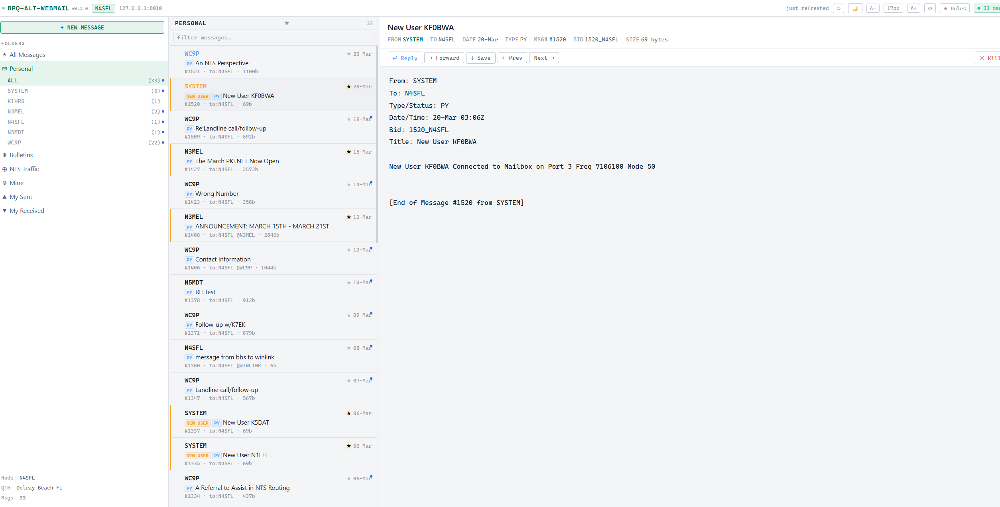
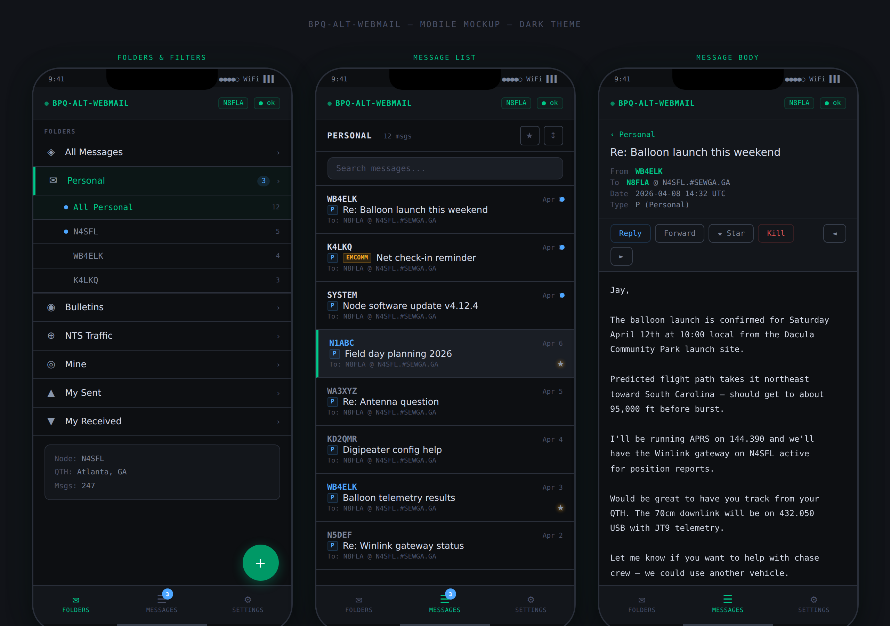

# BPQ-Alt-WebMail

A modern, single-file webmail interface for [BPQ32](https://www.cantab.net/users/john.wiseman/Documents/BPQMailChat.html) packet radio BBS nodes. Drop one HTML file into your BPQ HTML directory and open it in your browser.



### Mobile Layout

The same single HTML file automatically adapts to phones and tablets — no separate app or download needed.



## Features

### Interface
- **Three-pane layout** — folder sidebar, message list, message reader (desktop)
- **Mobile responsive** — automatically adapts to phones and tablets (≤768px). Bottom navigation bar, full-screen stacked views (Folders → Messages → Reader), floating compose button, collapsible message headers, and touch-friendly sizing. Same single HTML file — no separate mobile version needed
- **Mobile settings overlay** — tapping the gear icon opens a full-screen settings panel with quick-action buttons (Refresh, Theme, Font, Spacing, Rules), version/callsign/status info, and all config fields
- **Light and dark themes** — toggle with ☀/🌙 button, preference saved. Five themes: Dark, Dark Hi-Contrast, Light, Light Hi-Contrast, and Classic (the stock-BPQ32 tan/wheat look) — all work on both desktop and mobile
- **Adjustable font size** — A- / A+ buttons scale all text simultaneously
- **Line spacing** — cycle between Compact, Normal, and Relaxed line height in the message reader. Click the spacing button in the topbar or mobile settings. Preference saved across sessions
- **Draggable column widths** — drag the dividers between panes (desktop)
- **Auto-refresh** — polls BPQ every 5 minutes, shows new messages silently
- **Auto-detect host and port** — when served from BPQ, the setup screen automatically detects the correct host and port from the browser URL. No manual entry needed on first run
- **Session key auto-detection** — no manual token entry needed; detects and recovers from key rotation automatically
- **Remote access with login** — automatically handles BPQ's form-based login page when accessing remotely. Uses your BBS callsign and BBS password (not the sysop credentials from BPQ config `USER=` lines). Detects both quoted and unquoted HTML attributes. If credentials aren't configured, shows a clear error directing you to Settings. An optional **"remember" checkbox** next to the password keeps it for the current browser session only — uncheck it on shared or public-facing machines and you'll be prompted each visit

### Folders
- My Received (primary inbox), Bulletins, NTS Traffic, Mine, My Sent, All Messages
- **Unread badges** — My Received, Bulletins, and NTS Traffic show unread message counts in the sidebar, updated on every auto-refresh
- **My Received subfilters** — filter by sender callsign; SYSTEM pinned at top
- **Bulletin subfilters** — filter by TO category (SITREP, TECHNI, ARISS, etc.)
- **★ Favorite a bulletin topic** — the positive counterpart to unsubscribing. Click the ★ beside any TO entry in the Bulletins tree (or right-click / long-press it, or right-click a bulletin in the message list) and that topic pins to the top of the tree under a **★ Favorites** roll-up, which shows just the categories you starred. Every message in a favorited topic also counts as starred, so the ★ filter in the list header shows exactly those — the same star you already use on individual messages. Favoriting an unsubscribed topic resubscribes it; unsubscribing a favorite drops the favorite, so a topic is never both. Stored in `bpq_bull_fav`
- **Subscribe / unsubscribe to bulletin categories** — right-click (or long-press on a phone) any TO entry in the Bulletins tree, or any bulletin in the message list, to stop seeing that category. `WX`, `PKTNET` and the like drop out of the tree's *ALL* roll-up, out of the message list and out of the folder's unread badge. This is a local view filter only — nothing is killed or rejected on the BBS (unlike **Reject**, which asks the node itself to stop accepting the traffic), so unsubscribed categories stay listed at the bottom of the tree, dimmed and marked ⊘, ready to resubscribe. Picking one explicitly still shows its mail
- Message counts and unread indicators on every filter

### Message List
- Unread dot indicators, persisted across reloads
- **↓/↑ Sort order** — click in the list header to switch between newest-first (default) and oldest-first
- **★ Star filter** — click ★ in list header to show only starred messages
- **Multi-select** — hover a message to reveal checkbox; select multiple and bulk kill
- Search/filter box works across callsign, subject, type, message number
- **Right-click a message** (long-press on touch) for quick actions: unsubscribe from that bulletin category, save the sender to the address book, or reply

### Message Reader
- FROM, TO, DATE, TYPE, MSG#, BID, SIZE in header
- Reply, Forward, Save (.txt download), Prev/Next navigation
- **Kill** — marks message deleted in BPQ; killed messages hidden immediately and persist across reloads
- **📇+ Save Sender** — files the station you are reading into the address book: opens the contact card pre-filled with their callsign (and pre-looked-up, if QRZ is connected) so you can add a name, phone or group while the message is still in front of you
- **Reject filter** — block future messages by FROM callsign or TO category directly from the message you're reading. Writes the entry into BPQ's native Mail config reject list (same as the Reject From / Reject To fields on the Configuration page) — no need to leave the webmail interface

### NTS Traffic & Form Composers
- **NTS Radiogram composer** (Type → **T = NTS (Radiogram Form)**) — the way NTS traffic is composed; plain freehand “T” is no longer offered in the dropdown, though messages still go out as wire type `T`. Full ARRL radiogram form with REVIEW step, HX handling-code meanings, HX variables (HXA/HXB/HXF), auto-incrementing message number, ARRL extended-punctuation substitution (X-RAY, COMMA, QUERY, R decimal), and parsing of received radiograms back into the form
- **PKTNET Check-In composer (B/PKTNET)** — form-style check-in message (form concept N3MEL, form created KN4LQN)
- **ICS-213 General Message composer** — fields 1–8 matching the Winlink ICS213 General Message form (Ver 41.12), with a REVIEW step, a one-click **Winlink Wednesday** check-in preset, and station details remembered between messages. Sends as wire type P
- **NTS Delivered button** — one click marks any T-type message delivered via BPQ's `WMNDel`, with delivered-state tracking and NTS sub-folders
- **Compose deep links** — open a pre-filled compose window from any dashboard or bookmark via `#compose?to=CALL&subject=...` (see README-dashboard-links.md); works in already-open tabs too

### Address Book

**Sync between your own PCs (optional).** Turn on **Sync** in the address-book footer and this PC keeps one hidden message to your own callsign holding its copy of the book, and reads the ones written by your other machines — so contacts and groups added on the shack PC turn up on the laptop with no export, import or file copying. It never goes on the air: a message addressed to your own callsign at your home BBS stays on your node, and the carrier messages are hidden from every folder. Turn it on once per PC. Merging is per contact, newest edit wins, and deletions stick rather than being resurrected by the other machine; the one case it cannot save you from is editing the *same* contact on two PCs before either has synced. Carrier size is capped at 60 KB, which is roughly 200 contacts with every field filled.

A two-pane workspace — groups rail on the left, contact list on the right — opened from the topbar **📇 Address Book** button or the 📇 beside compose's To field. Concept: N3MEL.

- **Full contact card** — callsign, full name, street, city, state, ZIP, phone, email, website, free-text notes and group membership. Opened with **+ Add Contact**, by clicking any contact, or straight off a message. Older contacts simply have the newer fields blank
- **Contact groups** — a named list of callsigns. Groups reference contacts rather than copying them, so one edit updates a contact everywhere and a contact can belong to any number of groups. Renaming or deleting a contact follows through into every group; deleting a group never deletes contacts
- **Group picker with type-ahead** — groups show as removable chips; type to filter, and a name that does not exist yet is offered as **+ Create "…"**, so making a group is a side effect of typing it. Works the same with four groups or four hundred. Full keyboard support (↑↓, Enter, Backspace, Esc)
- **Send to a group or a selection** — **✉ Compose** in the toolbar addresses the contacts you have ticked, or everyone in the group you have open; right-clicking a group offers the same. BPQ accepts one recipient per message, so the app sends once per member behind a confirmation, with progress as it goes and a single summary at the end
- **Import** — paste callsigns separated by anything (spaces, commas, semicolons, newlines) or load/drop a CSV, with or without a `callsign,name,city,state` header. A preview states how many are new versus already known and what will be skipped before anything is written; every imported contact can be filed into any number of groups (including one created on the spot) in the same pass. Existing contacts are never overwritten — an import only fills blank fields
- **📇+ Save Sender** in the reader, and **📇+** beside compose's To field, file the station you are reading or replying to without leaving the message
- **Optional QRZ.com lookup** (your own paid QRZ XML Data subscription, stored only in your browser) fills name, street, city, state, ZIP and email from a callsign. There is no settings page for it — the **🔍 look up on QRZ** link on the contact card offers to connect the first time you use it, then carries straight on with the lookup. A lookup only ever fills blank fields
- Filter and sort the contact list A–Z, by most-used, or by last-used; drag contacts onto a group to file them; multi-select for bulk add-to-group, remove-from-group or delete

### Message Templates
- **Reusable To / Type / Subject / Body**, picked from the **Template** row in the compose window
- **Placeholders** — `{CALL}` `{QTH}` `{NAME}` `{DATE}` `{UTC}` `{TIME}` `{DATETIME}` fill in automatically from your config and the clock; `{{anything}}` prompts you for a value when you apply the template, so one template covers a message whose details change each time
- **Save as…** captures whatever is in the compose window as a new template, seeded with your subject as its name
- **Export / Import** as JSON, so a club or ARES group can share a set. Importing never overwrites — a clashing name becomes “Net notice (2)”

### Star Rules
- Built-in rule: stars SYSTEM messages with subject starting "New User" (new user notifications)
- Custom rules — click **★ Rules** to add your own: match on FROM, TO, SUBJECT, or TYPE with contains / starts with / equals logic
- Optional label tag shown in subject line

### Memory & Performance
- Body cache capped at 30 messages (FIFO eviction)
- Killed message list capped at 500 entries (localStorage)
- Background fetches pause when tab is hidden
- No external dependencies at runtime

---

## Installation

### Requirements
- BPQ32 (Windows) or LinBPQ (Linux/Raspberry Pi) with web server enabled (HTTPPORT in Telnet port config — commonly 8080 or 8010)
- Any modern browser (Chrome, Edge, Firefox)

### Quick Start — BPQ32 (Windows)

1. Download `bpq-alt-webmail.html` from the [latest release](https://github.com/jayflanzbaum-svg/BPQ-Alt-Webmail/releases/latest)
2. Copy it to your BPQ HTML directory:
   `C:\Users\<you>\AppData\Roaming\BPQ32\HTML\`
3. Open in your browser: `http://127.0.0.1:<your-HTTPPORT>/bpq-alt-webmail.html`
4. On first run, enter your callsign — host and port are auto-detected from the URL

> **Seeing `?` where icons should be?** The file is UTF-8, and every icon in the UI is a
> Unicode character (↩, ✕, ⊘, 📇, etc.). If it gets copied through anything that isn't a
> plain binary copy — opened and re-saved in a text editor without explicitly choosing
> UTF-8, sent through a text-mode/ASCII file transfer, relayed over a packet/BBS path
> that isn't 8-bit clean — those characters get replaced with literal `?` (two `?`s for
> emoji, since they're a surrogate pair) and can't be recovered client-side. Re-download
> the file fresh from the release and copy it straight into the HTML directory without
> opening it in an editor in between.

> **Upgrading? Hard-reload the page** (`Ctrl`+`Shift`+`R`, or `Cmd`+`Shift`+`R` on a Mac)
> the first time you open it after replacing the file, or you will very likely still see
> the old version. This is not the browser being awkward: BPQ's web server caches a
> file's `Last-Modified` date the first time it serves that path and never refreshes it,
> and it sends no `ETag` or `Cache-Control`. Browsers therefore fall back to *heuristic*
> caching and may reuse their copy for a day or more without even asking the server.
> Because Chrome and Firefox apply that heuristic differently, it often looks like "the
> new version works in one browser but not the other". See
> [`UPSTREAM-REPORT-G8BPQ.md`](UPSTREAM-REPORT-G8BPQ.md) for the details.
>
> If you would rather not think about it, bookmark the page with a version marker and
> bump it each upgrade — the app ignores the parameter:
> `http://127.0.0.1:8010/bpq-alt-webmail.html?v=1.7.0`

### Quick Start — LinBPQ (Linux / Raspberry Pi)

BPQ-Alt-WebMail works on LinBPQ without any changes — the web server and WebMail URL structure are identical to BPQ32.

1. Enable the web server in `linbpq.cfg` if not already done — add `HTTPPORT=8080` (or your preferred port) to your Telnet port section
2. Find your LinBPQ HTML directory (usually `~/linbpq/HTML/`) — create it if it doesn't exist:
   ```
   mkdir -p ~/linbpq/HTML
   ```
3. Download and copy the file:
   ```
   wget -O ~/linbpq/HTML/bpq-alt-webmail.html \
     https://github.com/jayflanzbaum-svg/BPQ-Alt-Webmail/releases/latest/download/bpq-alt-webmail.html
   ```
4. Open in a browser — from the Pi itself:
   `http://127.0.0.1:8080/bpq-alt-webmail.html`
   
   Or from another machine on your network (replace with your Pi's IP and port):
   `http://192.168.1.x:8080/bpq-alt-webmail.html`

> **Upgrading?** Hard-reload the page (`Ctrl`+`Shift`+`R`) after replacing the file —
> see the note in the Windows section above for why. It applies equally on LinBPQ.

> **Seeing `?` where icons should be?** See the note in the Windows section above — same
> cause (the file's Unicode characters getting mangled by a non-binary copy/transfer),
> same fix (redownload and copy straight in, no editor in between).

> **Headless Pi tip:** Most Raspberry Pi BPQ nodes run headless with no local display. Access the web interface from any browser on your network using the Pi's IP address. You can find it with `hostname -I` on the Pi.

> **Session key note:** The session key auto-detects regardless of whether you access from localhost or a remote IP. No manual configuration needed.

### Enabling the Web Server (both platforms)

If you haven't enabled the BPQ web server yet, add an HTTPPORT line to your Telnet port block in `bpq32.cfg` or `linbpq.cfg`:

```
TELNET
HTTPPORT=8080
TCPPORT=8011
...
ENDTELNET
```

Restart BPQ after making this change. You can verify it's working by opening `http://127.0.0.1:8080` — you should see the BPQ node menu page.

---

## Usage Notes

**Session key rotation** — BPQ generates a new session token each login. The app detects this automatically and recovers without any action needed.

**Killing messages** — BPQ marks messages as killed but doesn't purge them immediately (housekeeping runs periodically). This app hides killed messages locally right away and remembers them across reloads so they don't reappear.

**My Received inbox** — uses BPQ's `/WebMail/WMtoMe` endpoint which returns personal messages addressed to your callsign. Client-side filtering ensures only P-type messages to your call are shown.

**Star rules** — rules match against list metadata (fast, no body fetch required). The FROM field for My Received is resolved from the message body header for accuracy.

---

## Configuration

Click **⚙ Settings** in the topbar to access settings:
- **Host / Port** — defaults to `127.0.0.1:8080`. Auto-detected from the browser URL on first run when served from BPQ
- **BBS Callsign** — your BBS login callsign, also used to filter My Received
- **BBS Password** — your BBS password (not the sysop password from `USER=` lines in your BPQ config)
- **Session key** — leave blank for auto-detection
- **Signature** — multi-line field appended to replies, forwards, and new messages. Supports line breaks so you can format it like:
  ```
  73
  Jason, N8FLA
  BPQ Node: N4SFL-8
  ```

Click **Reset Setup** to clear all settings and run first-time setup again.

---

## Tested With

- BPQ32 v6.0.24 / v6.0.25 (Windows 10/11)
- LinBPQ v6.0.24 / v6.0.25 (Raspberry Pi OS, Ubuntu)
- Chrome 133, Edge 133, Firefox 134
- Mobile: iOS Safari, Chrome for Android (responsive layout)

> If you test on a platform not listed here and it works, please open an issue or PR to add it.

---

## Contributing

Pull requests welcome. The entire app is a single HTML file — no build step, no dependencies, no toolchain. Just edit `bpq-alt-webmail.html` and test against a live BPQ node.

Please test against at least one real BPQ node before submitting. The BPQ message list format has quirks (column shifts, session key rotation, message type flags) that are hard to reproduce synthetically.

---

## Credits

Developed by **N8FLA** (Jason) — [Boca Bearings](https://bocabearings.com) / Delray Beach, FL
Node: `N4SFL.#SFL.FL.USA.NOAM`  
GitHub: [jayflanzbaum-svg](https://github.com/jayflanzbaum-svg)

BPQ32 by John Wiseman G8BPQ — [cantab.net/users/john.wiseman](https://www.cantab.net/users/john.wiseman/Documents/BPQ32%20Documents.htm)

Address Book concept: N3MEL, who also maintains a [suite of HTML packet forms](https://www.tprfn.net/html-form-suite) worth a look if you need one this app doesn't ship. Internet-mail reply-to and compose-cursor fixes: Chris AE7GE.

---

## License

MIT — free to use, modify, and distribute. Credit appreciated but not required.
73 de N8FLA
